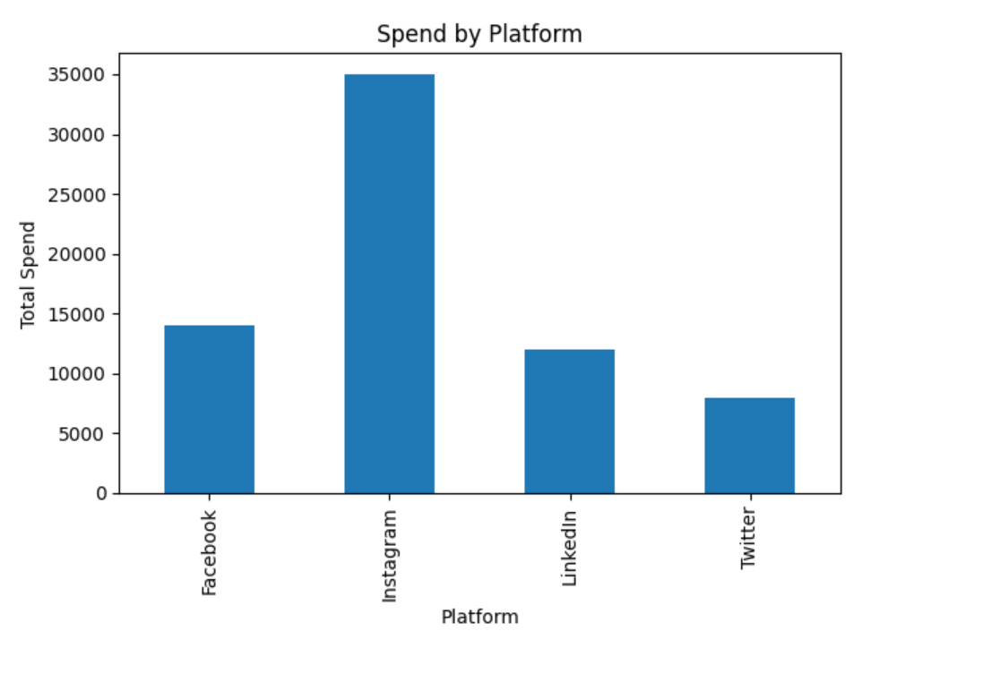
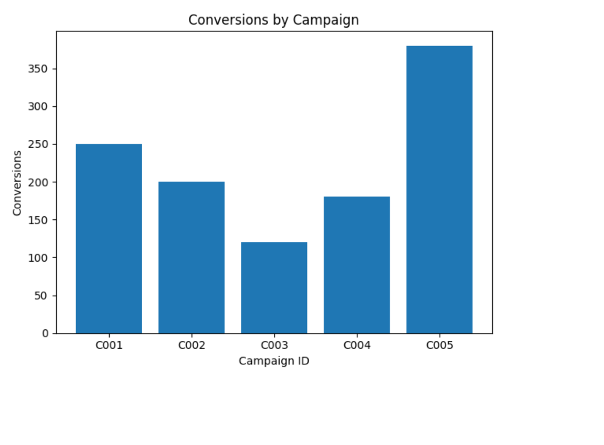

# Task 2: Social Media Campaign Performance Analysis

## Objective
To analyze social media campaign data and evaluate performance across platforms using Python.

## Tools Used
- Python
- Pandas
- Matplotlib
- Jupyter Notebook / Google Colab

## Key Insights
- Instagram campaigns achieved the highest engagement and conversions.
- Higher spend does not always guarantee higher conversions.
- LinkedIn showed efficient conversion with moderate spending.

## Visualizations

### Spend by Platform

### Conversions by Campaign

